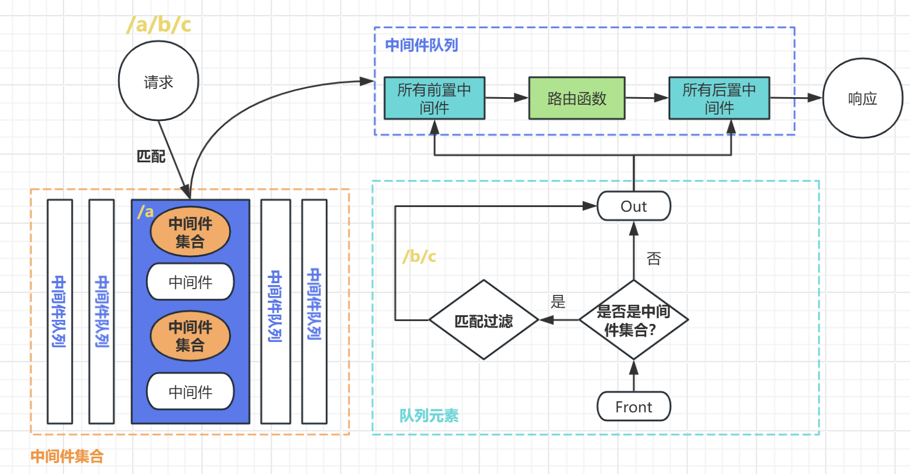
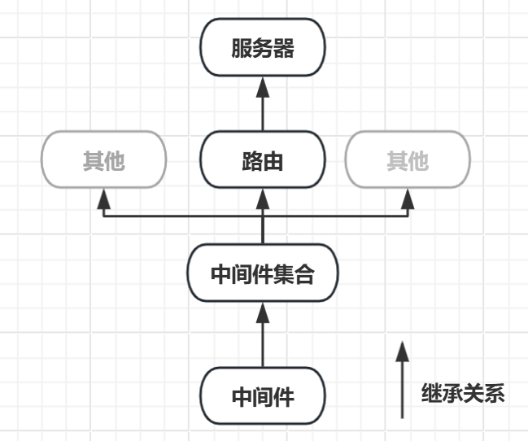
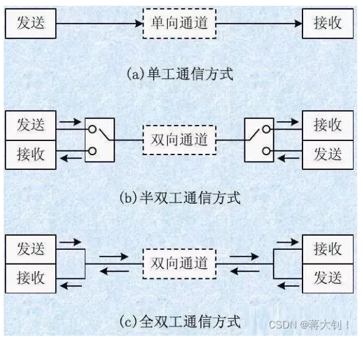
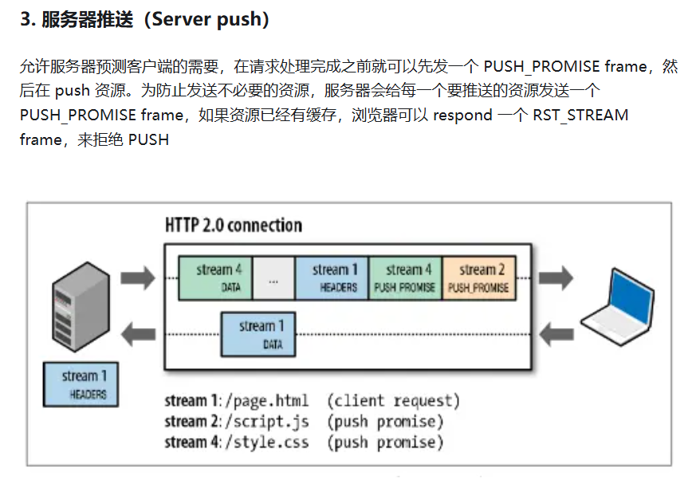

# HTTP 通信

应用层协议，有更加复杂的、规范的消息头格式（请求/响应）。如果想要完全从 asio/tcp 开发一个 HTTP 服务器，需要自己一行一行地解析请求消息，并处理每个字段的含义，执行对应逻辑，并返回响应消息。因此我们这里采用现有的 `beast` 来开发 HTTP 服务器

## 中间件/路由/服务器

原型设计如下（参考了 expressjs 的设计理念）

- 中间件是用来处理请求的函数，多个中间件组成一条链，并通过 `next` 顺序执行。**路由函数就是一个中间件**

- 路由是负责注册路由函数（get/post），也可以注册其他中间件（use），因此路由可以看成是一个中间件集合，并且认为中间件集合和中间件是一致的
  - 中间件处理，直接调用方法执行即可
  - 中间件集合处理，需要先从集合中过滤出中间件，然后再调用方法执行
  - 会形成嵌套，中间件集合里面包括另一个中间件集合



- 并且服务器是根路由，可以包含多个子路由。由于服务器本身也是一个路由，因此路由有的功能，服务器也有



```c++
// 中间件
typedef std::function<void(const Request &, Response &, NextFunction next)> RequestHandler;

// 中间件集合
class MiddlewareCollection : public RequestHandler
{
  protected:
    // 不同路径下的中间件队列 ---> 组成中间件集合
    std::map<PathArgument, std::deque<RequestHandler>> middleware_map;
  public:
    // 注册中间件/或者中间件集合
    void Use(const PathArgument &path, RequestHandler handler);
}

// 路由
class router : public MiddlewareCollection
{
  public:
    // 注册路由函数
    void Get(const PathArgument &path, RequestHandler handler);
    void Post(const PathArgument &path, RequestHandler handler);
}

// 服务器
class http_server : public router {}
```

## Updated

实现了 JSON 中间件 (内置支持 Query) 和 跨域请求中间件

- 中间件需要对 req/res 进行增强，例如添加不同类型的属性，但是 c++ 本身不支持这种操作，难道还是只能用 JSON 吗？？
- 模板实现动态增加属性：https://www.cnblogs.com/grass-and-moon/p/13680266.html
- 中间件可以使用函数实现，但对于复杂情况尽量使用仿函数来实现，参考<a href="./include/net_http/buildin-middlewares/cors.hpp">内置的中间件</a>

实现了指定路由加中间件，并且中间件支持请求方法匹配了，并且可以选择是否开启精确匹配

后面考虑支持批量注册中间件？

## Example

参考<a href="./src/http-client-server/main.cpp">基本使用</a>

# 回顾下目前的服务模式

让我们来回顾一下，并做一些概念补充

## 通信模式



- 单工模式，任何时刻只允许一个方向的通信，不能改变方向。例如 **SSE** 服务器向客户端发送数据流（下载）

- 半双工模式，任何时刻只允许一个方向的通信，但是可以改变方向。例如 **HTTP1.0/1.1** 的请求响应的形式

- 全双工模式，任何时刻都允许同时进行两个方向的通信。例如 **WebSocket**，**HTTP2.0** （服务器可以主动向客户端发送消息）

**半双工模式和全双工模式就是看在通信过程中，任意时刻，通信的两个方向有没有重叠，有则是全双工，没有则是半双工**

**Socket 本身是可以做到同时收发数据的，是全双工的。但是应用层不一定就是全双工**

## TCP

我们之前建立的 TCP 的 server/client 就是一个**长连接的全双工系统**，是 HTTP1.1 的模式 + 响应不需要等待 + 服务端可以主动发消息，更像是 WebSocket 的模式

## HTTP 

- **http1.0** 是短连接，请求头会带上 `Connection: close`，服务端判断有这个字段后，一次连接 (socket/端口) 只能接受一次请求并响应，响应完成就会关闭连接（socket/端口）【服务器直接关闭连接】，并且响应头也会带上 `Connection: close`。那么客户端下一次请求需要重新选择一个端口发送请求，所以你在服务器看到每次请求都会新来一个 socket 并且端口都是不一样的，服务器触发 `async_accept` 回调新建一个连接来处理这个 socket

- **http1.1** 是长连接，请求头会带上 `Connection: keep-alive`，告诉服务端一次响应完毕后不要关闭连接（socket/端口）。如果此时服务器返回的响应头也带有 `Connection: keep-alive` 告诉客户端我的确没有关闭，那么长连接有效；如果服务端关闭了，请返回带有 `Connection: close` 的响应头（注意服务端不要阳奉阴违，没关说关了，关了说没关），此时长连接仍然失败。

在长连接下，下一次连接，客户端将会复用这个连接（socket/端口），服务端不会触发 `async_accept` 不会新建一个连接了，仍然在之前的 socket 中处理。其次服务端还可以设置响应头 `Keep-Alive: timeout=60, max=10` 来告诉客户端我什么时候关闭连接。表示连接一分钟或者连接数量超过 10 个后服务端关闭连接，并返回带有 `Connection: close` 的响应头

- **http1.0** 有 **队头阻塞 head of line blocking** 的问题，由于 HTTP1.0 规定下一个请求必须在前一个请求响应到达之前才能发送，假设前一个请求响应一直不到达，那么下一个请求就不发送，后面的请求就阻塞了

- **http1.1** 允许在持久连接上可选的使用 **请求管道 pipeline**（请求管道必须基于持久连接）。在响应到达之前，可以将多余请求放入队列，也就是说可以发送多个 http 请求，不用等待响应，但请求依然是顺序发送的（**这就是我们上面实现 TCP 的消息发送队列，请求不需要等待响应，但是下一个请求必须等待上一个请求发送完毕，才能发送**）。还有一个限制服务器必须按照接收请求的顺序发送这些管道化请求的响应（**这就是我们上面实现 TCP 的消息发送队列，但不同的是，先处理完的响应先入队列发送，不需要等待前面请求的响应【多线程消息处理下，单线程消息处理仍然需要等待前面的响应完成，才能进行下一个响应】**），所以 HTTP/1.1 管道解决了请求的队头阻塞，但是没有解决响应的队头阻塞。

**我们这里实现 HTTP 服务器就是上面的两种，通过 `http1.0_connection.hpp/http1.1_connection.hpp` 来分别处理 HTTP1.0/1.1**

那么从定义上看，HTTP1.0/1.1 都是半双工模式，当然它们之间还有更多不同处，例如缓存字段等设置

https://blog.csdn.net/weixin_45910068/article/details/126290248

- **http2.0**  可以在一个连接中并发多个请求或回应，而不用按照顺序一一对应，这个链接可以承载任意流量的双向数据流。移除了 HTTP/1.1 中的串行请求，不需要排队等待，彻底解决「队头阻塞」问题，降低了延迟，大幅度提高了连接的利用率（无序发送，通过 Stream ID 重组）。HTTP/2 还在一定程度上改善了传统的「请求 - 应答」工作模式，服务端不再是被动地响应，可以主动向客户端发送消息、推送额外的资源。因此是 **全双工模式**

在 HTTP/2 中每个请求或响应的所有数据包，称为一个数据流（Stream）。每个数据流都标记着一个独一无二的编号（Stream ID）；
所有 HTTP2.0 通信都在一个TCP链接上完成，这个链接可以承载任意流量的双向数据流。每个数据流以消息的形式发送，而消息由一或多个帧组成。**不同 Stream 的帧是可以乱序发送的（因此可以并发不同的 Stream）【之前的请求必须是按顺序发送，Header-Body-Header-Body 的形式，下一个请求需要等待上一个请求发送完毕才能发送】，【而现在不需要了可以打乱，例如 HeaderFrame-HeaderFrame-BodyFrame-BodyFrame】**，因为每个帧的头部会携带 Stream ID 信息，所以接收端可以通过 Stream ID 有序组装成 HTTP 消息

什么意思呢？之前是通过**在一起的连续接收到的 Header-Body 来判断是一整个消息体**，**而现在分帧后添加了 Stream ID/End 等标识，通过这个来判断是不是一个整个消息体，因此可以无序发送**

客户端还可以指定数据流的优先级。优先级高的请求，服务器就先响应该请求

https://cloud.tencent.com/developer/article/1573513

https://juejin.cn/post/6894512912594010119 （HTTP1.1 是串行复用 TCP 连接，并行发送的请求还是等新开 TCP 连接（因为需要和服务端交流是否开启 Keep-Alive）一个域名最多 6 个 TCP 连接。而 HTTP2.0 是并行复用 TCP 连接，一个域名一个 TCP 连接）

### Question

很多人对 HTTP1.1 为什么是半双工模式可能感到困惑。既然请求可以缓存到队列中，并且不需要等待响应就可以请求，那么客户端在接受消息的同时不也可以发送消息吗（Socket 是全双工的）？这就存在重叠，是全双工？

以 HTTP1.1 举个例子：现在我发送两个请求 A 和 B

- 请求 A 入队列，请求 B 入队列，socket 发送请求 A
- 服务端接收到了请求 A，但是需要处理很长时间，此时 socket 是空闲的
- 那么 socket 可以继续发起请求 B
- 但是在发送请求 B 的过程中，请求 A 处理完了，socket 发送响应（socket是全双工的），此时不就出现了发送和响应重叠

**因此 HTTP1.1 是有机会触发全双工的，但并不是任意时刻**，因为这种情况的前提必须是客户端发送了请求，服务端才响应，不存在服务端主动发送消息这一条通道，因此还是半双工的。而 HTTP2.0 中**在一定程度上改善了传统的「请求 - 应答」工作模式**，服务端不再是被动地响应，可以主动向客户端发送消息、推送额外的资源，两条通道都可以随时触发，因此是全双工的 **（其实 HTTP2.0 的服务器推送也是需要客户端先请求，并不是连接之后就可以主动推送消息了，而像 WebSocket 连接后就服务器可以主动推送消息了）**。

https://cloud.tencent.com/developer/news/147804



# WebSocket 通信

# RPC 通信