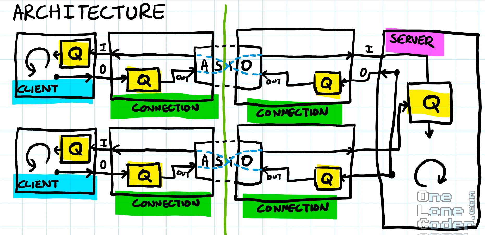
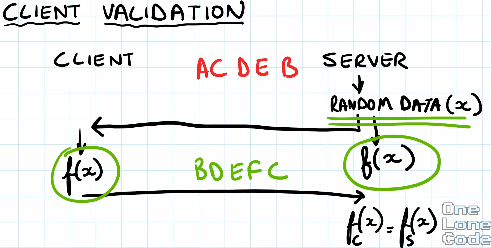

# 定义服务端和客户端的消息格式类 Message 

- 使用泛型来决定 `Message` 内部字段 `ID` 是哪种 `Enum Class`，例如账户请求、战斗请求、帧同步请求相关的枚举

- 而 `ID` 决定了该消息的类型，例账户请求包括登录/注册/修改信息，战斗请求包括匹配/进入地图，帧同步请求包括角色移动等等

# 服务端和客户端发送和接收消息模式

我们采用的方法是 <b>轮询消息队列，并进行处理</b>

对于 `Client` 来说，有一个接收消息的队列，然后通过轮询来处理消息，并且每个 `Client` 都有一个 `Connection` 对象，负责发送消息，那么也有一个发送消息的队列，不断轮询进行发送

对于 `Server` 来说，同样也是如此，只不过此时 `Server` 后面可能是多线程模型，多个 `Client` 发送的消息都被推入到同一个唯一的接收队列中，然后轮询处理消息。然后通过 `Connection` 对象，发送消息，同样也有一个发送消息的队列

`Connection` 里面维护了连接的 socket，发送消息的队列，和接收消息队列的引用（来自客户端/服务端）以及异步发送和接受消息的方法。这里面的队列都是线程安全的，因为 `Connection` 里面的异步操作（在子线程）需要操作队列（例如发送/接受），主线程也需要操作队列（例如主线程写入/读取消息等）

## 异步发送数据包

由于消息都被添加到了 `Connection` 里面的发送队列中，只要遍历队列，创建一个异步发送任务，在发送完成回调后，继续创建异步发送任务，即可确保顺序发送。

如果不用队列，那么有可能第一个包只发出了包头，第二个人包的包头就开始发送了，出现粘包现象，这时接收端无法正确接收一个包的包体了（把第二个包的包头做为了第一个包的包体一部分，自然也无法解析第二个包的包头了）

## 异步读取数据包

每次来一个数据包，往同一个 io_context（当然客户端和服务端的 io_context 是不同的，但是都在一个子线程中）中添加一个异步任务。该任务先读取 Header，拿到 Body Size 后，再添加一个异步任务读取 Body，全部读取完毕后，将整个数据包放入接收消息队列中，并且对数据包添加是哪个客户端发送过来的，后面好回应。

如果接收消息不用队列，好像也行？但是没法使用多线程来处理消息了，只能是一个任务一个线程。使用队列可以通过生产——消费模式，充分发挥多线程并发的能力

## Updated

- 使用 `std::move` 无法移动 `const` 变量，还是会调用拷贝构造函数。特别要注意在匿名函数值捕获中，默认是 `const`，如果需要移动捕获的变量，需要设置 `mutable`，并且捕获的变量本身不能是 `const`

- 将消息处理抽象为一个基类 `logic_systerm`，单独开辟一个线程处理消息，并且后面容易拓展

- 将服务端和客户端的 `connection` 分开，这样编译时不会出现客户端依赖服务端的情况

## Questions ?

避免客户端断开导致的连接的二次释放，如何优雅的关闭连接？

- 服务端会将所有的 `shared_ptr<connection>` 保存在 map 中。一旦客户端断开连接，那么 `connection` 内部首先触发读失败（在读的回调中），将失败向上传递给 `server` 类，由其从 map 中移除该连接即可，移除后连接对象后引用为 0，自动触发析构，释放队列资源，关闭 socket

- 如果在读之后还注册了并仍然存在写回调，那么读回调失败释放之后，写回调也会失败，此时在写回调中可能出现空指针异常（因为读失败已经释放了资源），该咋办呢？每次注册回调都往回调函数里面传入智能指针 `shared_from_this()`，引用加一，那么读回调失败中，移除连接对象引用不会为 0，只会减一，当所有注册的回调函数执行完毕后，引用才会为 0，此时在自动触发析构，释放队列资源，关闭 socket

- 读回调失败后，最好标记一下该连接即将释放，防止后面再注册回调，也就是注册回调都需要提前判断该连接是否即将释放

甚至关闭服务器？

- 由于服务器端的消息处理是在子线程中进行的，对于单线程模式（后面我们会实现多线程模式）来说 `io_context` 就可以堵塞在主线程，一直进行接收请求/收发消息等任务，如果你再单独开辟一个子线程运行 `io_context`，那么主线程就是干等了啥也不干，浪费线程资源，毕竟一个系统的线程数量是有限的。因此没必要再单独开辟一个子线程来运行 `io_context`。

- 通过监听退出信号，执行服务器退出逻辑
  - `io_context.stop()`，主线程不再堵塞，向下执行结束了，释放 `server` 类，触发析构函数
  - 在析构函数里面，标记下该服务器即将释放，通知消息线程不用堵塞了，然后 `message_thread.join()` 等待消息线程结束，析构函数完成
  - 一旦通知消息线程不用堵塞了，那么消息线程取出剩余任务做完，break 出 `while(1)` 循环，消息线程结束

序列化更复杂的对象：`json/protobuf`

读写分在不同的子线程中？

不同机器的字节序处理？

# 服务器负载和内存

现在我们的服务器是在主线程中不同的查询，输入队列是否有消息，有则进行处理，没有则一直查询

- 那么当没有客户端发送消息时，主线程一直在运行，导致 CPU 使用率飙升，相当于在做无用的死循环。<b>解决办法：通过条件锁让主线程休眠，当子线程有消息放入输入队列时，通知主线程苏醒</b>
- 当恶意客户端发送不和规矩的大量报文时，服务器也会放到输入队列中，导致服务器内存飙升。 <b>解决办法：进行客户端验证</b>

## 客户端验证

客户端验证流程：

1. 服务端接收到客户端请求后，先 `Write Validation` 发送一个验证码给客户端，并对验证码进行复杂数学运算，得到响应码
2. 客户端 `Read Validation` 收到验证码后，对验证码进行复杂数学运算，`Write Validation` 回一个响应码给服务器
3. 服务器 `Read Validation` 收到后，对比客户端返回的响应码和服务端计算的响应码是否一致，一致则验证通过，否则关闭连接

验证码和响应码计算：服务端产生一个随机验证码，通过一个难以破解的函数，计算出响应码。注意这个函数服务端和客户端需要采用一样的，并且不能泄漏。这些东西，一般都封装成 SDK，那么只有使用这个 SDK 发送的请求才会被接收，其他客户端的请求则被拒绝。

